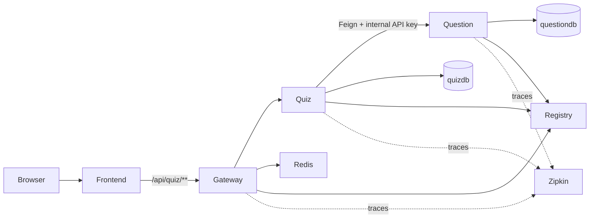

# Quiz Microservices Platform

[](https://github.com/albonidrizi/quiz-microservices-platform/actions/workflows/ci.yml)

A production-minded quiz platform built with Java 21, Spring Boot, Spring Cloud, React, PostgreSQL, Redis, Zipkin, and Docker Compose.

## Architecture


```mermaid
flowchart LR
    Browser --> Frontend
    Frontend -->|/api/quiz/**| Gateway
    Gateway --> Quiz
    Quiz -->|Feign + internal API key| Question
    Quiz --> QuizDB[(quizdb)]
    Question --> QuestionDB[(questiondb)]
    Gateway --> Redis
    Gateway --> Registry
    Quiz --> Registry
    Question --> Registry
    Gateway -. traces .-> Zipkin
    Quiz -. traces .-> Zipkin
    Question -. traces .-> Zipkin
```

The gateway exposes only `/quiz/**`. Question generation, answer retrieval, and scoring remain internal. Quiz submissions are validated against the stored question IDs before scoring.

## Quality And Security

- Input validation and consistent JSON error responses
- Protected internal service-to-service calls
- Tamper-resistant quiz scoring with duplicate-answer rejection
- Flyway database migrations and Hibernate schema validation
- Redis-backed gateway rate limiting
- Non-root runtime containers with health checks
- Same-origin frontend reverse proxy with no hardcoded API host
- Backend unit/integration tests and frontend unit tests
- CI gates for Maven, frontend lint/test/build/audit, and Docker image builds
- Dependabot updates for Maven, npm, Docker, and GitHub Actions

## Run With Docker

Requirements: Docker Desktop with Docker Compose.

```powershell
Copy-Item .env.example .env
docker compose up --build
```

Replace the placeholder secrets in `.env` before any shared or production deployment.

Open:

| Component | URL |
| --- | --- |
| Frontend | http://localhost:3000 |
| Eureka | http://localhost:8761 |
| Zipkin | http://localhost:9411 |

If upgrading from an older version that used Hibernate-managed schemas, recreate the local database volume once:

```powershell
docker compose down -v
docker compose up --build
```

## Local Verification

```powershell
mvn clean verify

Set-Location frontend
npm ci
npm run lint
npm test
npm run build
npm audit --audit-level=high
```

## Services

| Service | Responsibility |
| --- | --- |
| `api-gateway` | Public routing, CORS, discovery, and rate limiting |
| `quiz-service` | Quiz lifecycle and submission validation |
| `question-service` | Private question storage, generation, and scoring |
| `service-registry` | Eureka service discovery |
| `frontend` | React and TypeScript user interface |

## Configuration

See [.env.example](.env.example) for local defaults. Important production values:

- `POSTGRES_PASSWORD`
- `INTERNAL_API_KEY`
- `CORS_ALLOWED_ORIGIN`
- `TRACING_SAMPLING_PROBABILITY`

## API Flow

1. `POST /quiz/create` creates a quiz from a category.
2. `GET /quiz/get/{id}` returns questions without correct answers.
3. `POST /quiz/submit/{id}` validates the submitted question IDs and returns the score.

## Limitations

The quiz experience is intentionally public and does not include end-user accounts or a leaderboard. Add OIDC authentication before introducing user-specific or administrative features.
