# 🧠 Quiz Microservices Platform


A production-grade, distributed **Quiz Application** designed to demonstrate **Senior Cloud-Native Java** capabilities.
This project transitions a traditional monolithic logic into a robust **Microservices Architecture**, featuring centralized configuration, service discovery, distributed tracing, fault tolerance, and a modern frontend.

---

## 🏗️ Architecture Design

The system is composed of loosely coupled services that communicate via REST (Synchronous) and are orchestrated using Docker.

```mermaid
graph TD
    subgraph Client Layer
        User([👤 User])
        Frontend[⚛️ React Frontend]
    end

    subgraph Infrastructure Layer
        Gateway[🚪 API Gateway]
        Registry[®️ Eureka Server]
        Zipkin[️️🕵️‍♂️ Zipkin Tracing]
    end

    subgraph Service Layer
        Quiz[🧠 Quiz Service]
        Question[❓ Question Service]
    end

    subgraph Data Layer
        DB[(🐘 PostgreSQL)]
    end

    User -->|Interacts| Frontend
    Frontend -->|HTTP/REST| Gateway
    
    Gateway -->|Service Discovery| Registry
    Gateway -->|Route /quiz/**| Quiz
    Gateway -->|Route /question/**| Question

    Quiz -->|Feign Client Sync| Question
    Quiz -->|Read/Write| DB
    Question -->|Read/Write| DB

    %% Observability Connections
    Quiz -.->|Trace Data| Zipkin
    Question -.->|Trace Data| Zipkin
    Gateway -.->|Trace Data| Zipkin
```



## 🚀 Key Features

### 🛡️ Resilience & Fault Tolerance
*   **Circuit Breaker (Resilience4j)**: Implemented in `quiz-service`. If `question-service` experiences high latency or downtime, the system fails gracefully instead of cascading errors.
*   **Fallback Mechanism**: Default responses are provided when dependent services are unavailable.

### 🕵️‍♂️ Observability & Monitoring
*   **Distributed Tracing**: Integrated **Zipkin** and **Micrometer** to assign unique Trace IDs to requests. This allows valid debugging across service boundaries.
*   **Centralized Logging**: Logs can be aggregated (ready for ELK stack).
*   **Health Checks**: Spring Boot Actuator endpoints (`/actuator/health`) exposed for Kubernetes/Docker health probes.

### 🧪 Advanced Testing Strategies
*   **Integration Testing**: Uses **Testcontainers** to spin up ephemeral PostgreSQL instances for real-world database testing, avoiding the pitfalls of in-memory H2 databases.
*   **Unit Testing**: JUnit 5 and Mockito for isolated business logic validation.

### ⚡ DevOps & CI/CD
*   **Containerization**: Multi-stage Docker builds for optimized, small-footprint images (Alpine Linux).
*   **Infrastructure as Code**: `docker-compose.yml` orchestrates the entire stack (Database, Services, UI, Tracing).
*   **GitHub Actions**: Automated pipeline triggers on every push to build, test, and verify the codebase.

---

## 🛠️ Technology Stack

| Category | Technology | Decision Rationale |
| :--- | :--- | :--- |
| **Backend** | Java 17, Spring Boot 3 | LTS version for stability; Spring Ecosystem for rapid cloud-native dev. |
| **Microservices** | Spring Cloud (Eureka, Gateway, OpenFeign) | The standard for Java-based distributed systems. |
| **Frontend** | React (Vite), TypeScript, Tailwind CSS | Modern, type-safe, and highly performant UI development. |
| **Database** | PostgreSQL | Robust, ACID-compliant relational testing. |
| **Resilience** | Resilience4j | Lightweight fault tolerance library designed for Java 8+. |
| **Testing** | Testcontainers, JUnit 5, Mockito | "Shift-Left" quality assurance with real environment simulation. |

---

## 🚀 Getting Started

### Prerequisites
*   **Docker Desktop** (Engine 20.10+)
*   **Java 17 JDK** (optional, for local dev)
*   **Node.js 18+** (optional, for local frontend dev)

### One-Click Deployment 🐳
The entire platform (Frontend + Backend + DB) can be launched with a single command:

```bash
docker-compose up -d --build
docker-compose up -d --build
```

### 🛠️ Troubleshooting & Setup

#### 1. Database Seeding (Required for Initial Run)
The database starts empty. To populate it with questions (Java, Python, JS, Docker), run the following command after starting the containers:

```bash
Get-Content ./init-scripts/02-seed-data.sql | docker exec -i postgres psql -U postgres -d questiondb
```

#### 2. Service Stability
The `docker-compose.yml` is configured with `restart: on-failure` to handle database startup delays. If services (like `quiz-service`) appear down initially, they will automatically recover within 30 seconds.

### Access Points
| Service | URL | Creds/Info |
| :--- | :--- | :--- |
| **Frontend App** | [http://localhost:3000](http://localhost:3000) | Main UI |
| **API Gateway** | [http://localhost:8765](http://localhost:8765) | Entry point for APIs |
| **Eureka Dashboard** | [http://localhost:8761](http://localhost:8761) | Service Registry View |
| **Zipkin Tracing** | [http://localhost:9411](http://localhost:9411) | Trace Visualizer |
| **Swagger (Quiz)** | [http://localhost:8090/swagger-ui.html](http://localhost:8090/swagger-ui.html) | API Docs |

---

## 📂 Project Structure

```bash
quiz-microservices-platform/
├── api-gateway/          # 🚪 Entry point & Routing
├── frontend/             # ⚛️ React + Tailwind UI
├── question-service/     # ❓ Domain service for Questions
├── quiz-service/         # 🧠 Domain service for Quizzes
├── service-registry/     # ®️ Service Discovery Server
├── docker-compose.yml    # 🐳 Orchestration Config
└── .github/workflows/    # 🤖 CI/CD Pipeline
```

## 🔮 Future Roadmap
*   **Security**: Implement OAuth2/OIDC with Keycloak.
*   **Event-Driven Architecture**: Introduce RabbitMQ/Kafka for asynchronous quiz submission.
*   **Kubernetes (K8s)**: Create Helm charts for cluster deployment.

---

Made with ❤️ by **Albon Idrizi**
